# BookLand

BookLand is an online book store mobile application. It is designed by 5 developers. It was a 2020 Spring term Software Engineering course prooject. 

## Team Members

- **Nurbüke Teker:** Proeject Manager

- **Esra Kabakbaş:** Software Architect 

- **Gökhan Özeloğlu:** Software Configuration Manager

- **Burak Yılmaz:** Software Analyst

- **Fatma Usalan:** Software Tester

## Technology Stack

- Flutter 
- Spring Boot 
- Spring Security
- Maven
- XAMPP
- MySQL 
- Postman
- OneSignal
- Android Studio
- Intellij IDEA

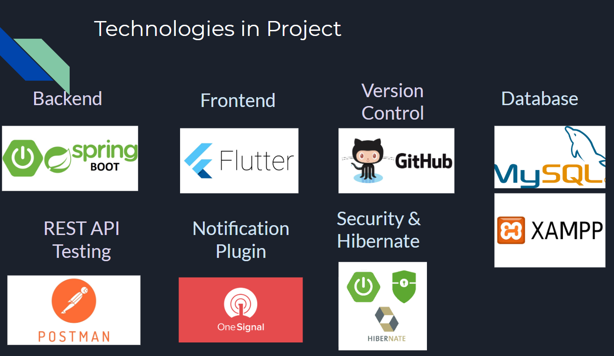

## UI

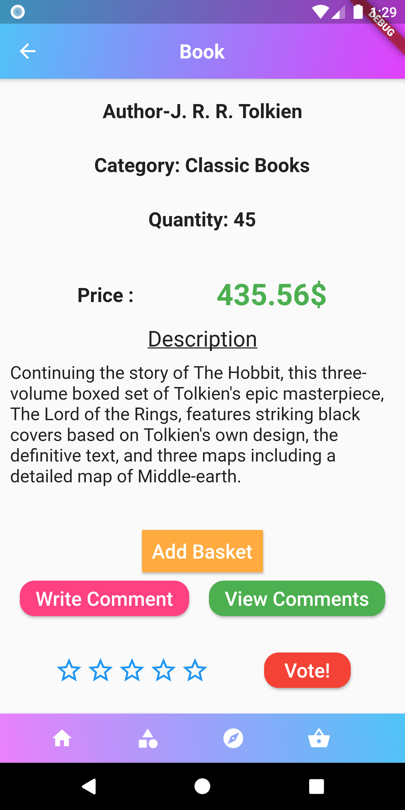

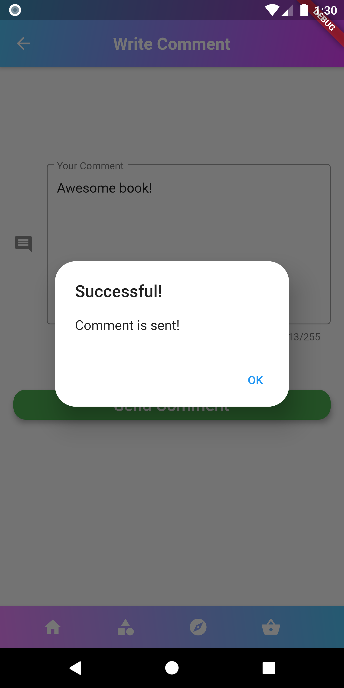

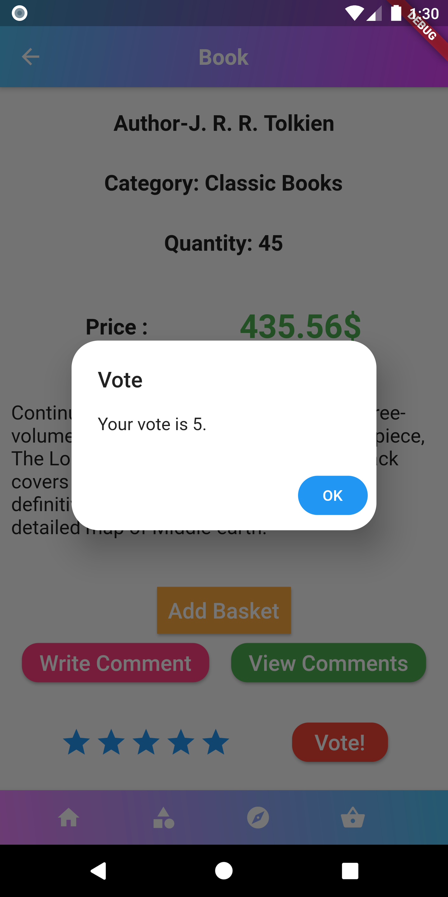

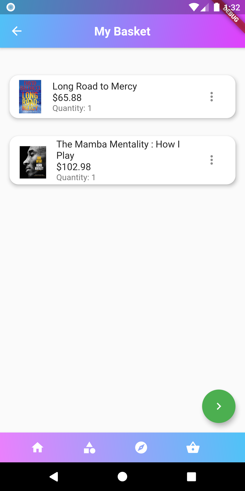

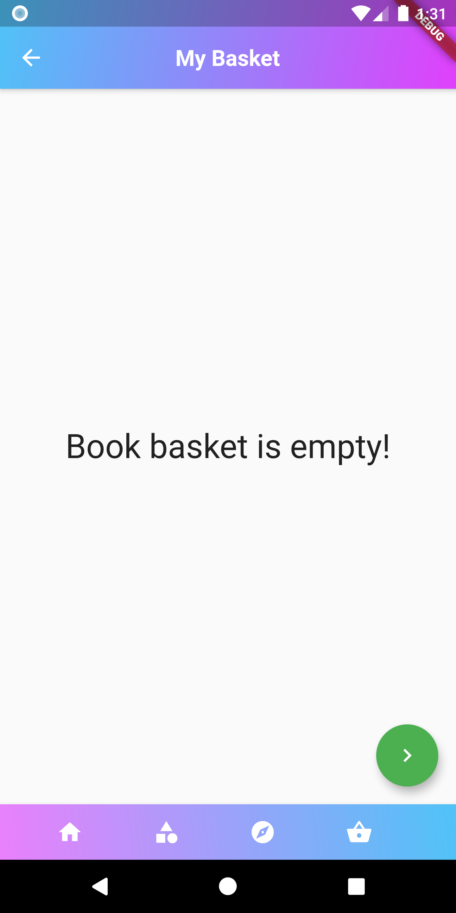

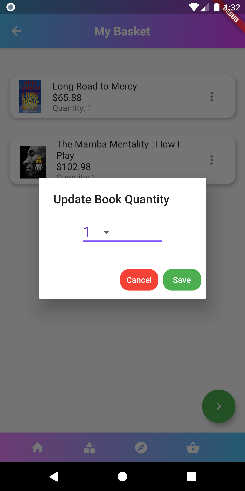

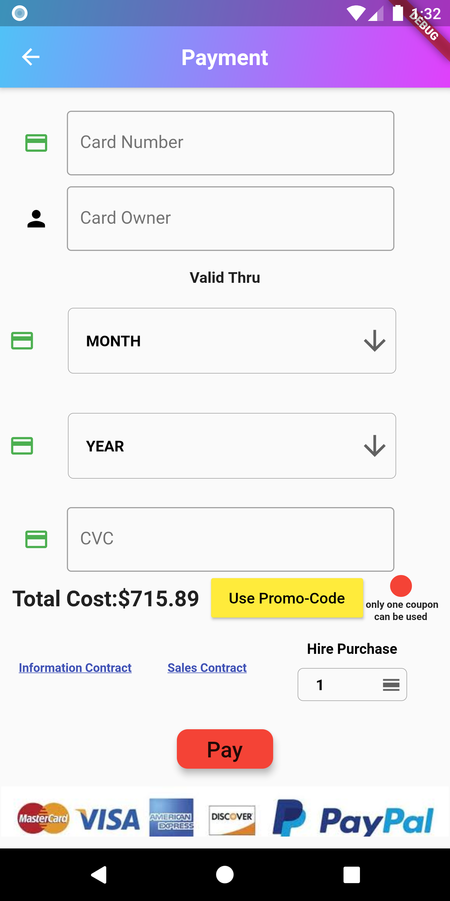

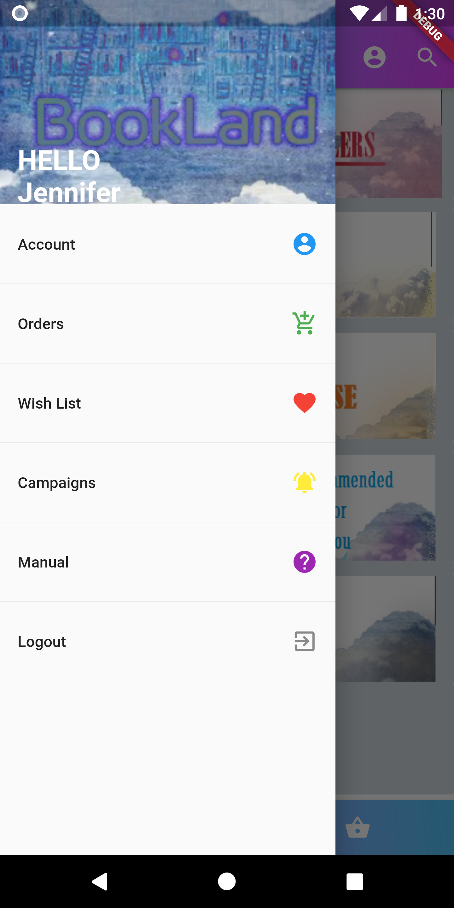

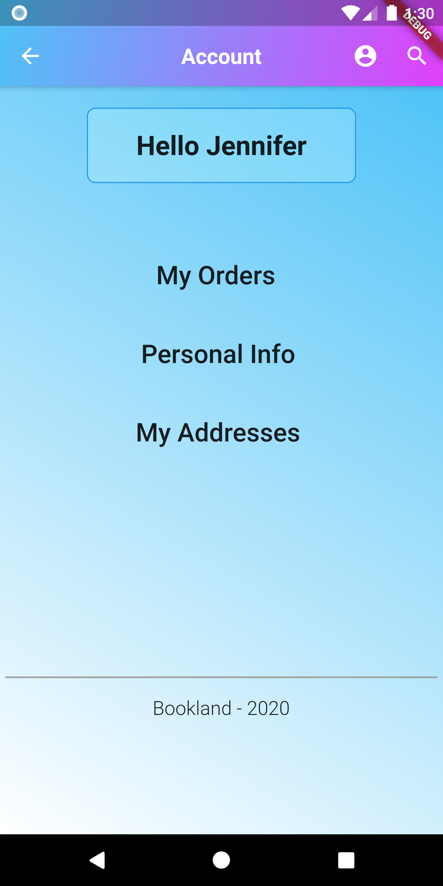

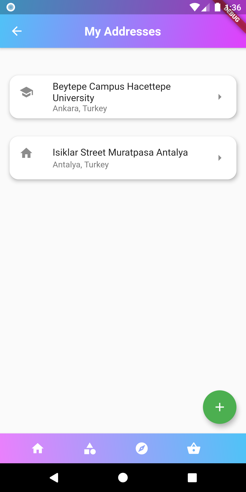

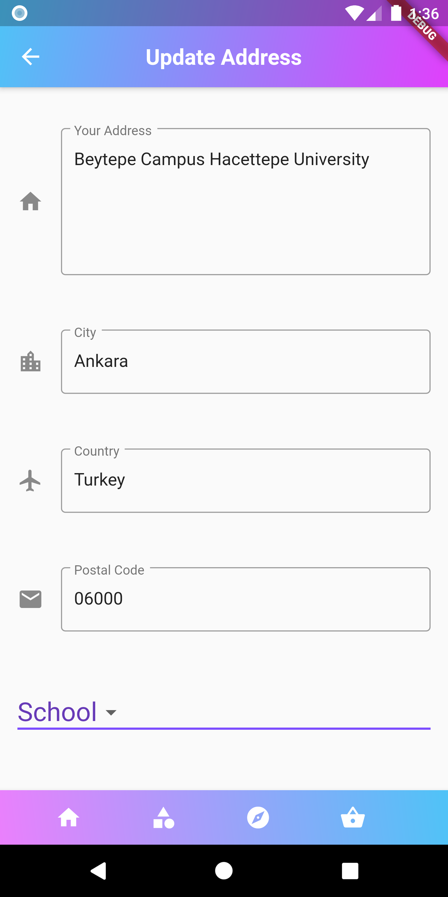

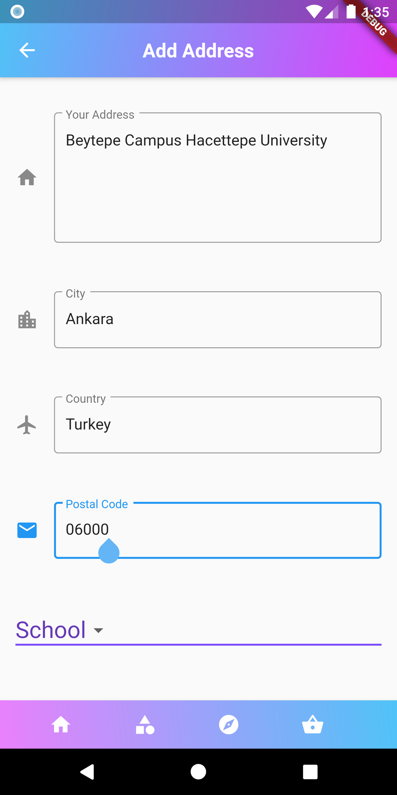

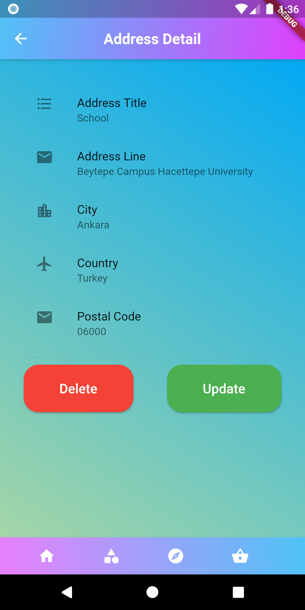

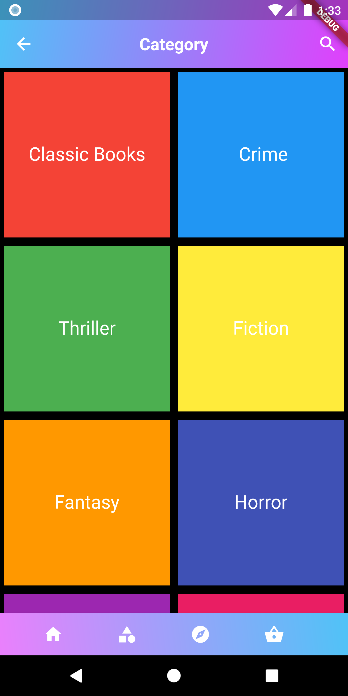

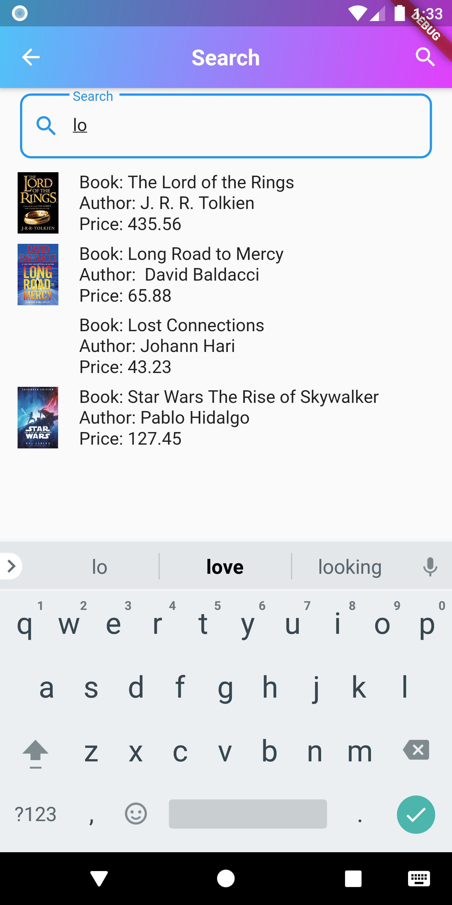

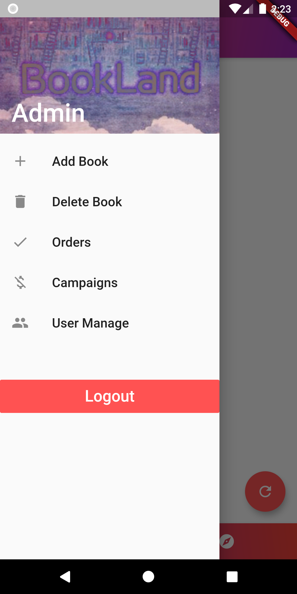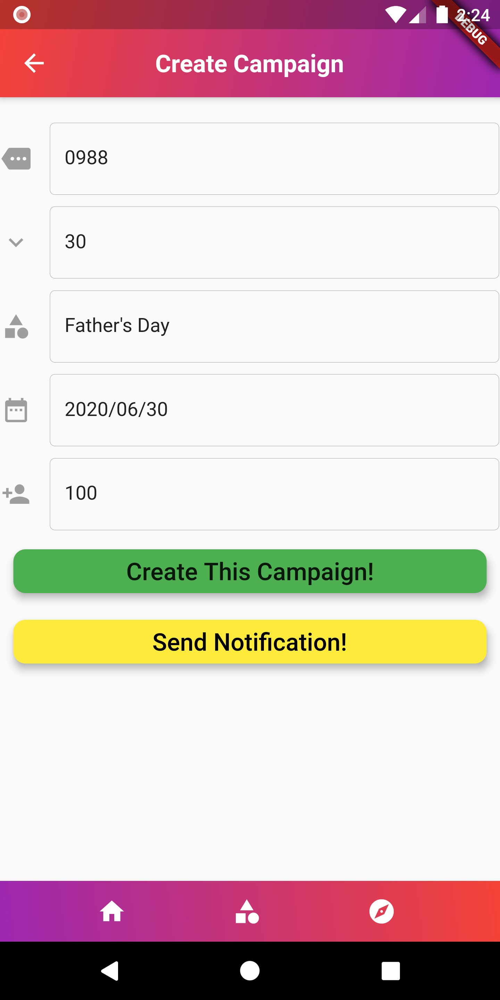

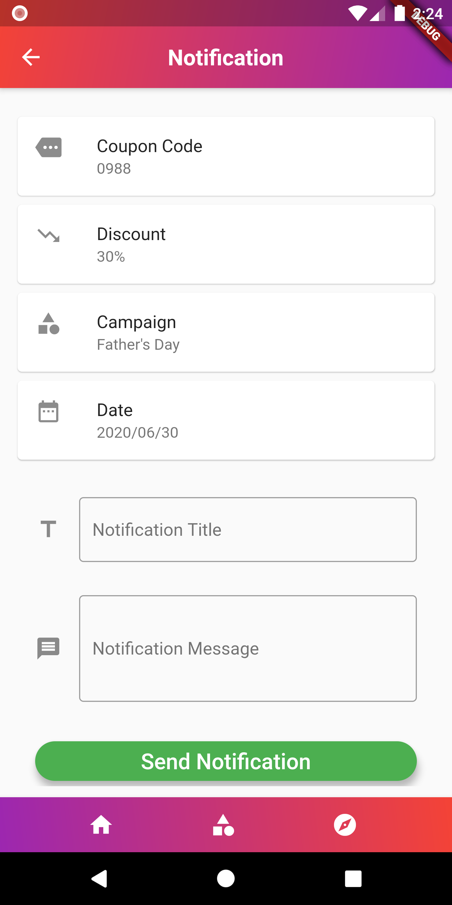

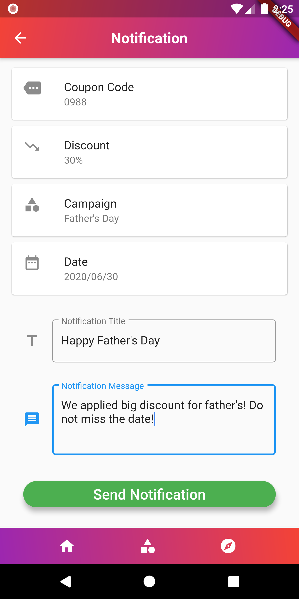

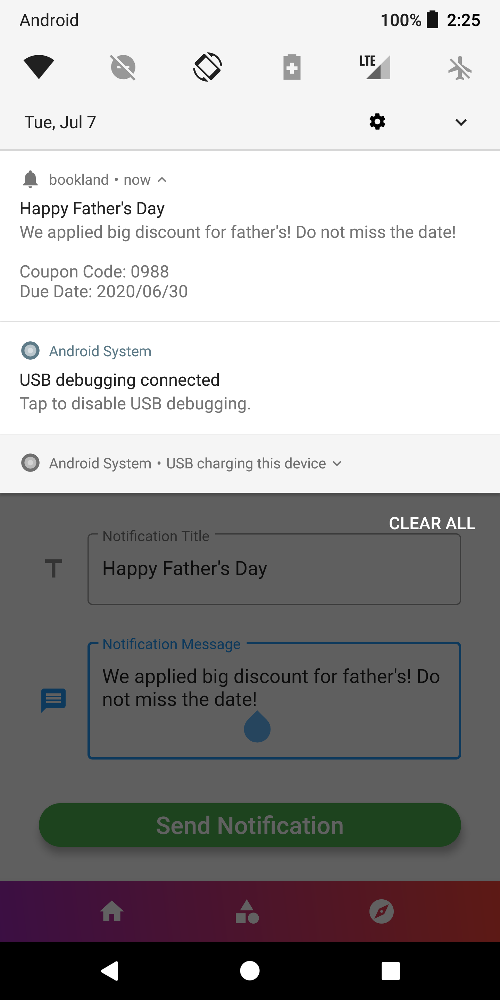
